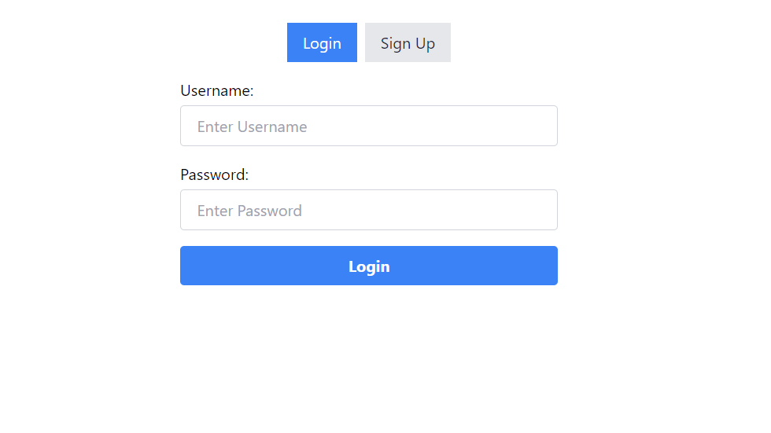
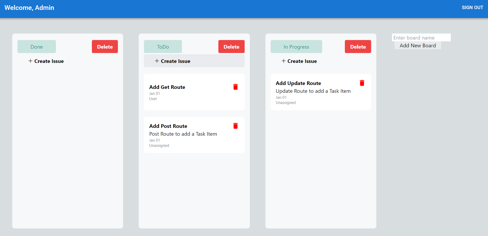
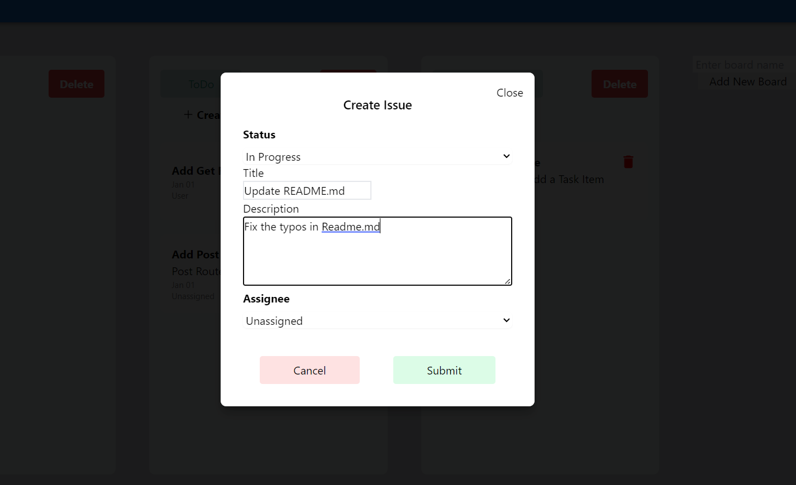

# Kanban Board

## Description

A Kanban board is a visual tool used to manage tasks and workflows. It consists of columns representing different stages of work, allowing teams to track progress, identify bottlenecks, and prioritize tasks effectively.

## Getting Started

### Executing program

- Clone/Fork this repository

#### Running Server

```
cd server
npm install
npm run start
```

#### Running Client

```
cd client
npm install
npm run dev
```

#### For Testing

<b> Admin </b>

User: Admin <br>
Passsword: admin

<b> User </b>

User: User
Password: user

### Tech Stack

<b> Frontend </b>

1. React + Tailwind + TypeScript
2. React Beautiful dnd for Drag and Drop
3. React Icons

<b> Backend </b>

1. Nodejs + ExpressJs

<b> Database </b>

1. Sqlite

### Screenshots






